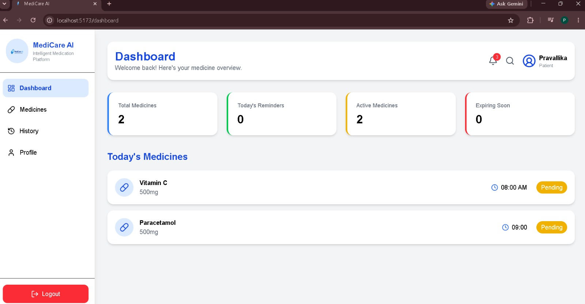
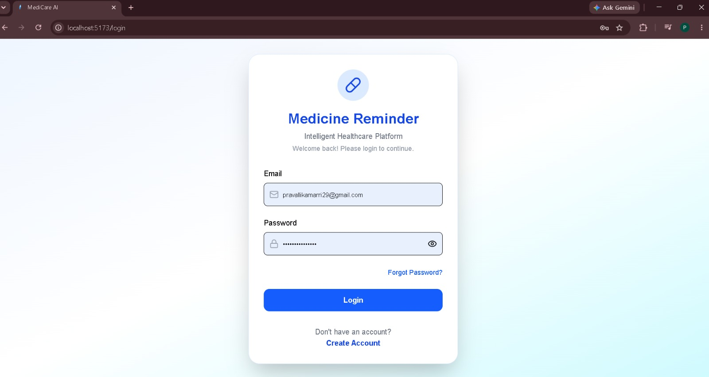
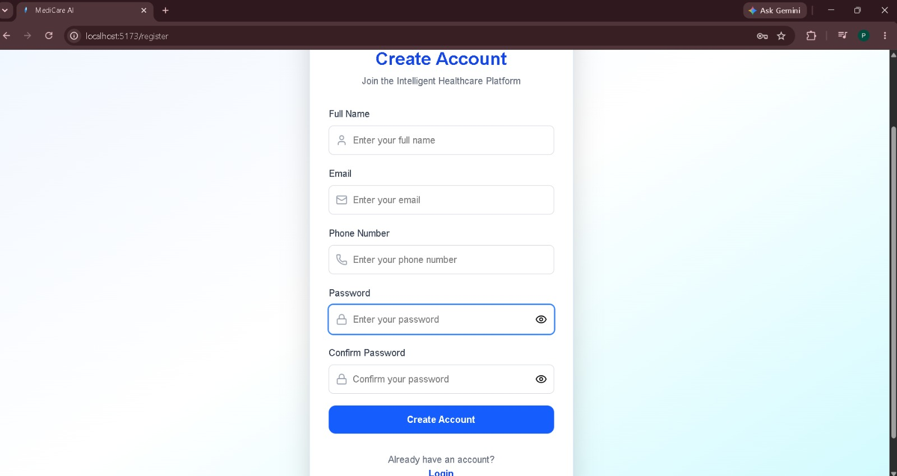
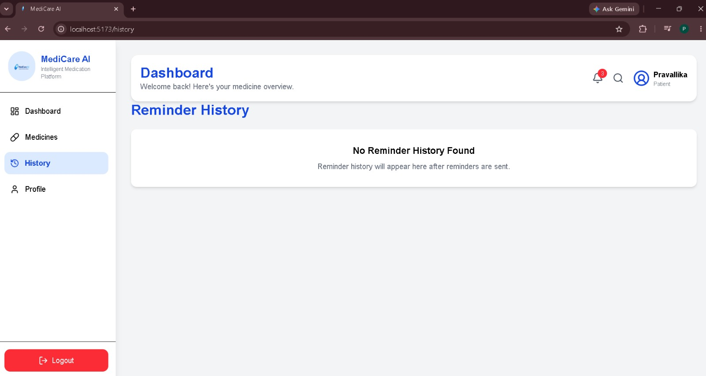

🚀 MediCare AI – Milestone 2

# 💊 MediCare AI – Intelligent Medication Reminder Platform

<div align="center">


# 📌 Project Overview

**MediCare AI** is an Intelligent Medication Reminder Platform that helps users manage their daily medications through secure authentication, medicine management, automated reminder scheduling, email notifications, SMS notifications, and a personalized dashboard.

This milestone focuses on building the core backend services, reminder automation, and user-facing medicine management features.

✅ Milestone 2 Features Completed

# 🔐 User Authentication

• User Registration

•  User Login

•  JWT Authentication

•  Protected Routes

•  Secure Password Hashing (bcrypt)

•  Logout Functionality

# 💊 Medicine Management

Add Medicine

View Medicines

Edit Medicine

Delete Medicine

Search Medicines

Pause / Resume Medicines

# ⏰ Reminder Scheduling

APScheduler Integration

Automatic Reminder Checking

Email Reminder Service

SMS Reminder Service

Reminder Status Tracking

Graceful Error Handling for Failed Notifications

# 📊 Dashboard

Total Medicines

Active Medicines

Today's Reminder Count

Expiring Soon Medicines

Dynamic Dashboard Statistics

# 🎨 Frontend

Responsive Dashboard

Sidebar Navigation

Professional UI

Dashboard Cards

Search Functionality

Medicine Status Indicators

🗄 Database

PostgreSQL Database

SQLAlchemy ORM

User Table

Medicine Table

Reminder History Table

# 🛠 Backend

FastAPI REST APIs

Scheduler Startup Integration

JWT Authorization

Exception Handling

API-based Architecture

# 🧰 Technology Stack

Frontend

React.js

Vite

Tailwind CSS

Axios

Backend

FastAPI

SQLAlchemy

APScheduler

JWT Authentication

Bcrypt

Database

PostgreSQL

Notification Services

Gmail SMTP (Email)

SMS API Integration

# 📂 Current Project Status

✅ User Authentication Complete

✅ Medicine CRUD Complete

✅ Dashboard Complete

✅ Reminder Scheduler Complete

✅ Email Notifications Complete

✅ SMS Notifications Complete

✅ Reminder History Database Integration Complete

# 📂 Project Structure

medicine-reminder-platform/

│
├── backend/
│   ├── app/
│   │   ├── auth.py
│   │   ├── database.py
│   │   ├── email_service.py
│   │   ├── main.py
│   │   ├── models.py
│   │   ├── scheduler.py
│   │   ├── schemas.py
│   │   ├── sms_service.py
│   │   └── __init__.py
│   │
│   ├── requirements.txt
│   └── .env
│
├── frontend/
│   ├── public/
│   │   └── favicon.png
│   │
│   ├── src/
│   │   ├── assets/
│   │   │   └── logo.png
│   │   │
│   │   ├── components/
│   │   ├── pages/
│   │   ├── services/
│   │   ├── routes/
│   │   ├── styles/
│   │   ├── App.jsx
│   │   └── main.jsx
│   │
│   ├── screenshots/
│   │   ├── login.png
│   │   ├── dashboard.png
│   │   ├── medicines.png
│   │   ├── history.png
│   │   └── profile.png
│   │
│   ├── package.json
│   └── vite.config.js
│
├── docs/
│
├── README.md
│
├── .gitignore
│
└── LICENSE

# ⚙ Installation

## Clone Repository

```bash
git clone https://github.com/yourusername/medicine-reminder-platform.git
```

---

## Backend Setup

```bash
cd backend

python -m venv venv

venv\Scripts\activate

pip install -r requirements.txt

uvicorn app.main:app --reload
```

Backend runs at

```
http://127.0.0.1:8000
```

---

## Frontend Setup

```bash
cd frontend

npm install

npm run dev
```

Frontend runs at

```
http://localhost:5173
```


🚧 Planned Future Enhancements

The following features are planned for future milestones and are not yet implemented:

### 📜 Medication History Tracking UI

Dedicated page showing:

- Missed Medicines

- Completed Medicines

- Reminder Timeline

- Medicine Adherence

---

### 📊 Analytics Dashboard

- Weekly Reports

- Monthly Reports

- Adherence Percentage

- Missed Medicine Charts

---

### 👨‍👩‍👧 Caregiver Notifications

Notify family members when important medicines are missed.

---

### 📱 Mobile Application

Android/iOS application using React Native.

---

### 🌍 Multi-language Support

Support for multiple languages.

---

# 🎯 Milestone Progress

## ✅ Milestone 1

- Authentication

- Medicine CRUD

- Dashboard

- PostgreSQL Integration

- FastAPI APIs

---

## ✅ Milestone 2

- APScheduler

- Email Notifications

- SMS Notifications

- Reminder History Database

- Dashboard Statistics

- Search Medicines

- Pause/Resume Medicines

- Improved UI

---

## 🚀 Upcoming Milestone

- Push Notifications

- Medication History Tracking UI

- Analytics Dashboard

- Reminder Reports

- Mobile App


# 📸 Screenshots

## Dashboard



## Login



## Register



## Medicine Page


## Edit Medicine


## Reminder History



## Profile Page


# 🎯 Milestone 2 Outcome

This milestone successfully delivers the core functionality of an Intelligent Medication Reminder Platform with secure authentication, medicine management, automated scheduling, email notifications, SMS notifications, and a responsive dashboard.

The platform is designed with a modular architecture, making it easy to extend with advanced reminder tracking, push notifications, analytics, and reporting in future milestones.

# 📝 Note

Medication History Tracking (UI) and Browser Push Notifications are intentionally listed as future enhancements because they have not yet been implemented. The current version focuses on delivering a stable and fully functional medication reminder platform with email and SMS reminder services.

# 👩‍💻 Developed By

**Marri Lalitha Raga Pravallika**

Electronics & Communication Engineering Student